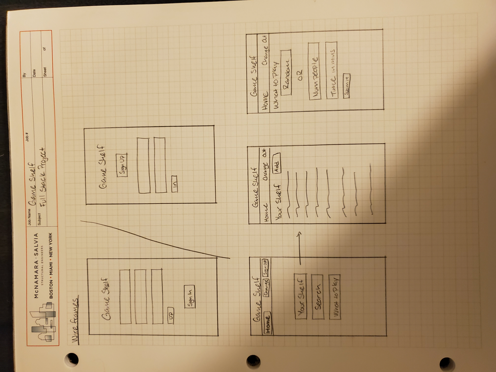
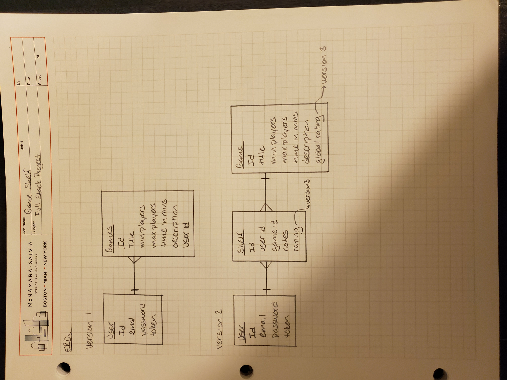

## Amanda's Game Shelf

## Technologies

- Ruby on Rails
- Handlebars
- JavaScript
- jQuery
- AJAX
- HTML5
- CSS
- Bootstrap

## Planning and Development

## Unsolved Problems

## Wireframes and User Stories

Wireframes:

  

ERDs:
  

User stories:
- As a user, I want to add a game to my shelf.
- As a user, I want to be able to see all the games on my shelf.
- As a user, I want to be able to search for games on my shelf by title of the game so that I don't need to remember an id.
- As a user, I want to be able to filter results by characteristics for a game so that I could look up all games that can be played with a certain number of people or in a certain time.
